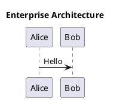
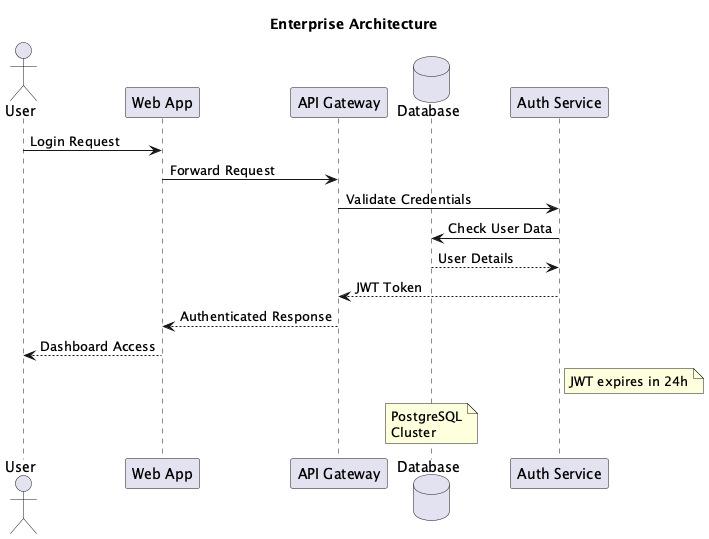

# belajar-quarto
sesuai namanya

## Tutorial PlantUML dengan Quarto

### 1. Install PlantUML

**macOS/Linux:**
```bash
# Download PlantUML JAR
curl -L -o plantuml.jar https://github.com/plantuml/plantuml/releases/download/v1.2025.7/plantuml-1.2025.7.jar

# Atau install via homebrew
brew install plantuml
```

**Windows:**
```cmd
# Install Java dulu (jika belum ada)
choco install openjdk

# Install PlantUML via Chocolatey
choco install plantuml

# Atau download JAR manual
curl -L -o plantuml.jar https://github.com/plantuml/plantuml/releases/download/v1.2025.7/plantuml-1.2025.7.jar
```

### 2. Buat file .puml

Contoh `test.puml`:


### 3. Generate PNG

**macOS/Linux:**
```bash
# Menggunakan JAR file (resolusi standar)
java -jar plantuml.jar -tpng test.puml

# Untuk kualitas lebih baik (high DPI)
java -jar plantuml.jar -tpng -Sresolution=300 test.puml

# Atau jika sudah install via homebrew/package manager
plantuml -tpng test.puml
```

**Windows:**
```cmd
# Menggunakan JAR file (resolusi standar)
java -jar plantuml.jar -tpng test.puml

# Untuk kualitas lebih baik (high DPI)
java -jar plantuml.jar -tpng -Sresolution=300 test.puml

# Atau jika sudah install via Chocolatey
plantuml -tpng test.puml
```

### 4. Embed di Quarto

Di file `.qmd`:
```markdown
## Contoh PlantUML

{#fig-plantuml width=60%}
```

### 5. Preview Quarto

```bash
quarto preview custom.qmd
```

### Tips

- Gunakan `width=60%` atau `height=300px` untuk resize image
- File .puml bisa di-version control
- Output PNG konsisten dan tidak butuh runtime
- Untuk diagram kompleks, PlantUML lebih powerful dari Mermaid
- Untuk image yang lebih crisp, tambahkan CSS:
  ```html
  ```{=html}
  <style>
  img {
      image-rendering: crisp-edges;
      -webkit-optimize-contrast: auto;
  }
  </style>
  ```
  ```

### Cross-Platform Notes

**Windows:**
- Gunakan PowerShell atau Command Prompt
- Path separator bisa pakai `/` di Quarto markdown
- Install Chocolatey untuk package management yang mudah
- Java JRE/JDK required untuk PlantUML

**macOS/Linux:**
- Terminal default sudah support semua command
- Homebrew (macOS) atau package manager distro (Linux)
- Java biasanya sudah tersedia atau mudah diinstall
